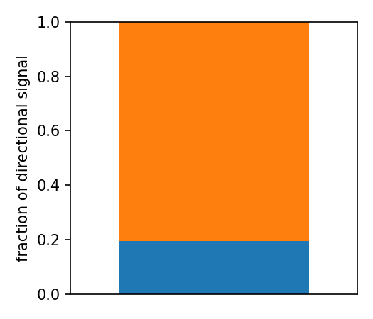
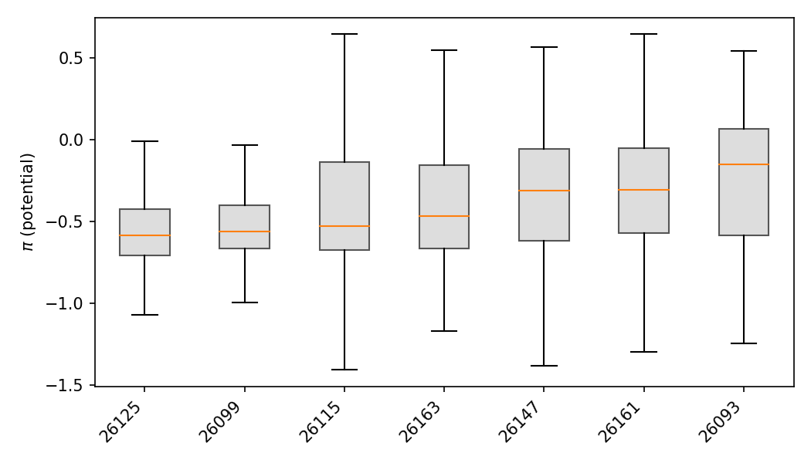
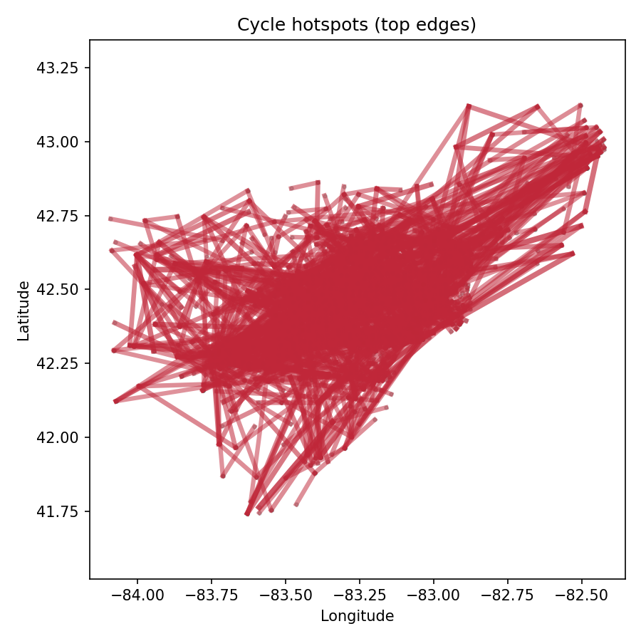
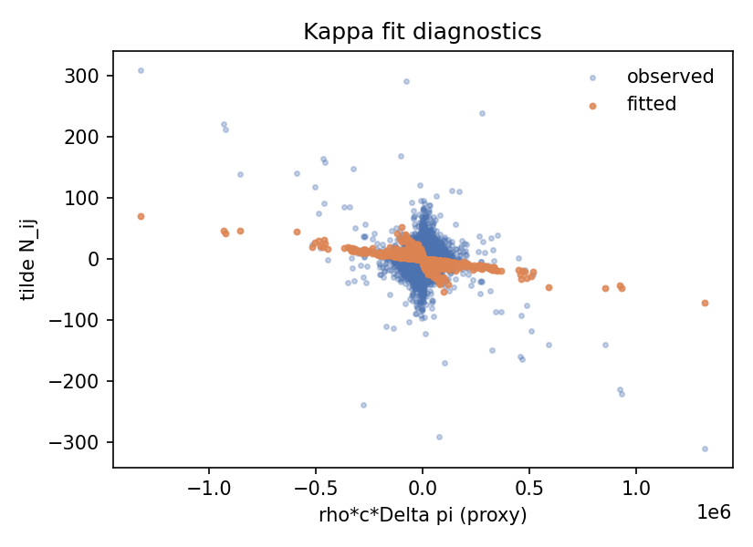
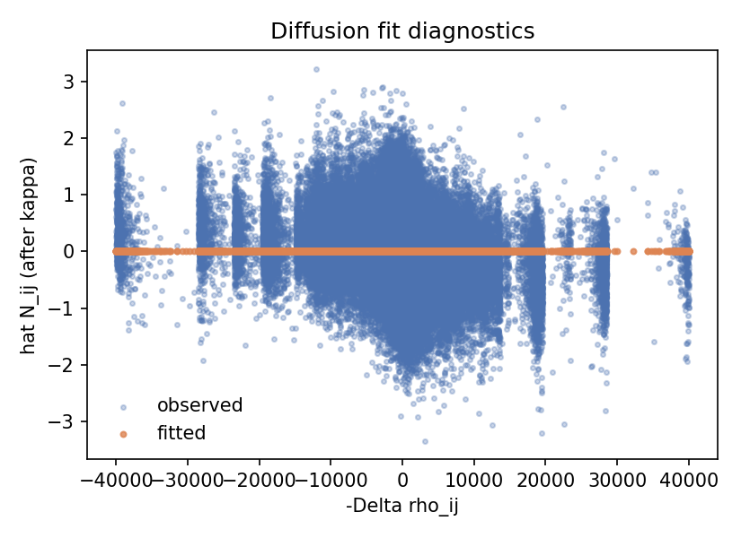
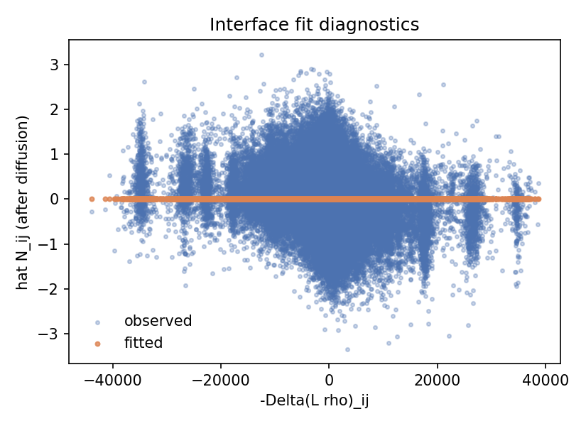
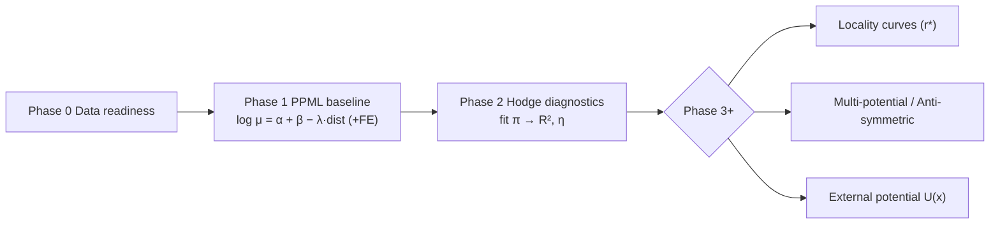

Project: SEMCOG 2020 OD Diagnostics

## Overview (1‑liner + 3 commands + key figures)

- One‑liner: A minimal, reproducible pipeline on SEMCOG 2020 tract→tract OD to diagnose "potential + non‑reciprocity" structure and evaluate locality (CSV/Parquet + figures).

### Quickstart (Phase 1–2)
```bash
# 1) Baseline (PPML + distance / admin FE)
python -m project.src.cli baseline_glm --eps 0.5 --county-pair-fe --backend sklearn --max-iter 5000 --standardize-dist

# 2) Robust Hodge (on GLM residuals)
python -m project.src.cli potential_hodge_glm \
  --weight-type cap --cap-tau 200 --drop-self \
  --sample-edges 120000 --bins-dist 8 --bins-weight 8 \
  --seed 42 --max-edges 150000 --maxiter 300 --tol 1e-5

# 3) Export figures
python -m project.src.cli export_figs
```

<p align="center">
  
  <br><em>R² (potential fit) higher → more "potential‑like"; η (non‑reciprocity) higher → stronger loops.</em>
</p>

<p align="center">
  
  <br><em>Low‑π → High‑π is the residual flow preference; county‑level π reveals net attraction gradients.</em>
</p>

### Next: fit structure terms (4 analyses)
```bash
# 4a) Loop scale & hotspot corridors
python3 -m project.src.cli rot_diagnostics --topk 2000 --topcycles 500 --nodes-geo project/data/geo/tracts.geojson

# 4b–d) Structure-term regressions (κ, D, Γ)
python3 -m project.src.cli pde_fit_kappa
python3 -m project.src.cli pde_fit_diffusion
python3 -m project.src.cli pde_fit_interface --knn 6
```
Outputs:
- JSON diagnostics: `results/diagnostics/rot_summary.json`, `top_cycles.csv`, `pde_kappa.json`, `pde_diffusion.json`, `pde_interface.json`.
- Figures (requires `matplotlib`): `fig_cycles_hotspots.png`, `fig_kappa_scatter.png`, `fig_diffusion_scatter.png`, `fig_interface_scatter.png`, alongside the original 3.
- Acceptance checks: (i) η level & corridor list, (ii) κ significance, (iii) ΔR² for diffusion, (iv) Γ significance.

<p align="center">
  
  <br><em>Figure 4 — non‑reciprocal corridors (top‑K |resid| edges) anchored on tract centroids.</em>
</p>

<p align="center">
  
  
  
  <br><em>Scatter diagnostics for κ (potential term), diffusion D, and interface Γ (requires matplotlib).</em>
</p>

Goal
- Based on 2020 SEMCOG 7-county tract→tract OD snapshot (columns: `work,home,S000`), build a minimal, executable pipeline to diagnose "potential + non-reciprocity" structure and evaluate locality, and export reusable results (CSV/Parquet + figures).

Why
- Remove pure scale effects first; test if a single potential is sufficient (reciprocal) or if cycles/non-reciprocity dominate.
- Use geometry to produce distance-layered locality curves.
- Provide a foundation for subsequent "single/multi-potential + external features U(x)" fitting.

Layout
- data/
  - raw/semcog_tract_od_intra_2020.csv          # tract→tract OD, columns: work,home,S000 (you can symlink or copy from dataset/od_flow/)
  - geo/tracts.geojson                           # your local tract boundaries or centroids (see below)
  - processed/                                   # generated
- results/
  - diagnostics/                                 # generated
  - figures/                                     # generated
- src/
  - io.py            # read/write, normalization, geometry/centroids, distance computation
  - gravity.py       # baseline independence normalization (optional)
  - hodge.py         # least-squares potential fit + Hodge indicators (gradient/curl fractions)
  - locality.py      # distance-layered R²/energy curves
  - features.py      # placeholder for node/edge features
  - cli.py           # command-line entry

## Workflow (Mermaid)



## Requirements
- Python 3.8+.
- Baseline PPML (`baseline_glm`) **requires** `pandas`, `scikit-learn`, and (optionally) `statsmodels`. 缺任何一个库时命令会直接报错（不再自动 fallback），确保你在同一个 Python 环境安装好：`pip install pandas scikit-learn statsmodels patsy`.
- 其它步骤在缺少 `numpy`/`pyarrow`/`matplotlib` 时仍会退化为 CSV-only（例如图像会跳过并提示需要安装 matplotlib）。

## Geo centroids
- `data/geo/tracts.geojson` should include tract GEOIDs and either internal points or centroids:
  - GEOID keys accepted: `GEOID`, `GEOID10`, or `geoid`.
  - Lat/Lon keys accepted (preferred): `INTPTLAT10`, `INTPTLON10`, `centroid_lat`, `centroid_lon`.
  - If none found, a naive centroid (bbox mid) is computed instead.

## Quickstart
- Place your OD CSV at `data/raw/semcog_tract_od_intra_2020.csv` (columns: `work,home,S000`).
- Place your tract GeoJSON at `data/geo/tracts.geojson`.
- Run end-to-end:
  - `python -m project.src.cli all`
- Or step-by-step:
  - `python -m project.src.cli prepare`
  - `python -m project.src.cli hodge --use-independence`
  - `python -m project.src.cli locality --bins 12`

## Data & artifacts

| Path | Phase | Meaning / key fields |
|---|---|---|
| `data/raw/semcog_tract_od_intra_2020.csv` | Phase 0 | Raw OD (`work, home, S000`) |
| `data/geo/tracts.geojson` | Phase 0 | Centroids (`GEOID, INTPTLAT/LON`) |
| `data/processed/od_clean.parquet|csv` | Phase 0 | Cleaned OD |
| `data/processed/edges_with_distance.csv` | Phase 0 | OD + `distance_km` |
| `data/processed/od_residual_glm.parquet|csv` | Phase 1 | `mu_hat, log_resid_glm` |
| `results/diagnostics/baseline_glm_summary.json` | Phase 1 | PPML convergence, λ (distance), deviance, backend |
| `results/diagnostics/nodes_potential_glm.csv` | Phase 2 | Potential π per tract |
| `results/diagnostics/edges_decomp_glm.csv` | Phase 2 | `g_ij, pred=π_j-π_i, resid, weight` |
| `results/diagnostics/locality_report.json` | Phase 2 | Locality curve (r0 vs R²) |
| `results/diagnostics/rot_summary.json` | Phase 2+ | Loop scale (η) + hotspot summary |
| `results/diagnostics/top_cycles.csv` | Phase 2+ | Top triangular loops `(i,j,k,C_ijk)` |
| `results/diagnostics/pde_kappa.json` | Phase 3 | κ fit summary (`kappa`, t stats, n_pairs) |
| `results/diagnostics/pde_diffusion.json` | Phase 3 | Diffusion D fit summary |
| `results/diagnostics/pde_interface.json` | Phase 3 | Interface Γ fit summary + adjacency size |
| `results/figures/*.png` | Phase 2–3 | `r2_eta.png, pi_box_by_county.png, fig_locality_curve.png, fig_cycles_hotspots.png, fig_kappa_scatter.png, fig_diffusion_scatter.png, fig_interface_scatter.png` |

## Metrics & acceptance

### Metrics
- R² (potential fit): fraction of directional signal explained by the potential (higher is better)
- η (non‑reciprocity): fraction of one‑way/loop signal (lower is better)
- κ (potential term coefficient): strength of $(\rho c \Delta\pi)$ in $\tilde N$, from `pde_kappa.json` (significant → retain potential term)
- D (diffusion): coefficient on $-\Delta\rho$ in residuals (`pde_diffusion.json`, ΔR² shows incremental benefit)
- Γ (interface): coefficient on $-\Delta(L\rho)$ (`pde_interface.json`; significant iff boundary curvature matters)

### Acceptance checklist
- [ ] PPML converged; λ (distance) reasonable (often negative); `Σμ≈ΣF`
- [ ] `nodes_potential_glm.csv` and `edges_decomp_glm.csv` generated
- [ ] vs independent baseline: **R² ↑, η ↓** under the same sampling/weight settings
- [ ] `rot_summary.json` reviewed (η level, hotspot corridors) and `top_cycles.csv` inspected
- [ ] κ/D/Γ fits produce interpretable, significant coefficients or documented drop (JSONs + scatter plots)

## Glossary

| Symbol/Name | Meaning | Notes |
|---|---|---|
| `F_ij` | Raw OD (work=i, home=j job count) | CSV column `S000` |
| `R_i=Σ_j F_ij` | Total outflow at work tract i | Marginal |
| `W_j=Σ_i F_ij` | Total inflow at home tract j | Marginal |
| `E_ij` | Independence expected = `R_i·W_j/ΣF` | Scale‑effect baseline |
| `μ̂_ij` | PPML expectation | Phase 1 output |
| `log_resid` | `log((F_ij+ε)/(E_ij+ε))` | Independent residual |
| `log_resid_glm` | `log((F_ij+ε)/(μ̂_ij+ε))` | GLM residual (recommended) |
| `g_ij` | Directional signal = `log_resid_ij − log_resid_ji` | Anti‑symmetric |
| `w_ij` | Weight, default `F_ij+F_ji` (can cap `min(·,τ)`) | Hodge weighting |
| `π` | Potential (node value) | `g_ij ≈ π(j) − π(i)` |
| `R²` | Potential fit | Higher is better |
| `η` | Non‑reciprocity | Lower is better |
- data/processed/
  - nodes.csv: tract GEOID, lat, lon
  - edges.csv: work, home, S000 (filtered to SEMCOG 7 counties)
  - edges_with_distance.csv: edges + distance_km
  - edges.parquet (if pyarrow available)
- results/diagnostics/
  - global_metrics.csv: N nodes, E edges, gradient/curl energy fractions, totals
  - node_potential.csv: GEOID, phi
  - edge_hodge_metrics.csv: work,home,weight,a_ij,pred,resid
  - locality_curve.csv: bin stats and energy/R² fractions vs distance
- results/figures/
  - locality_curve.png (if matplotlib available)

## Counties (SEMCOG 7)
- Wayne(26163), Oakland(26125), Macomb(26099), Washtenaw(26161), Monroe(26115), Livingston(26093), St. Clair(26147).

## Pipeline & reports
- Detailed workflow and acceptance: `project/PIPELINE.md`
- Phase 0–2 results and figures: `project/REPORT.md`
- Bilingual structure summaries: `project/docs_summary/en/structure_results.md`, `project/docs_summary/zh/structure_results.md`

## Troubleshooting
<details><summary>⚠️ No figures?</summary>

- `matplotlib` missing: `pip install matplotlib`, then rerun `export_figs`.
- Diagnostics missing: run `baseline_glm` and `potential_hodge_glm` first.
</details>

<details><summary>⚠️ PPML λ = 0?</summary>

- Increase iterations: `--max-iter 5000` (or higher); standardize distance: `--standardize-dist`.
- Start without county×county FE; confirm nonzero λ with only origin/dest FE + distance, then add complexity.
- Check `edges_with_distance.csv` coverage: share of zero distances should not be high.
</details>

## Appendix: Independent baseline (for teaching/benchmark)

```bash
# Hodge on independence residuals (g_ij from log((F_ij+ε)/(E_ij+ε)))
python -m project.src.cli hodge --use-independence --eps 0.5 --max-edges 150000 --maxiter 300 --tol 1e-5

# Locality curve (train+evaluate) under independence residuals
python -m project.src.cli locality --bins 10
```

## Directory layout
```
project/
  data/
    raw/
    geo/
    processed/
  results/
    diagnostics/
    figures/
  src/
    io.py  gravity.py  hodge.py  locality.py  features.py  export_figs.py  cli.py
  docs_summary/
    en/structure_results.md
    zh/structure_results.md
  PIPELINE.md  REPORT.md  README.md
```
