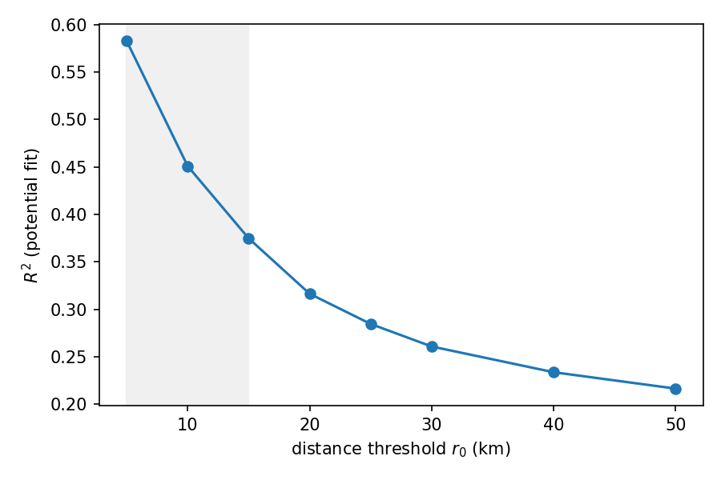

# SEMCOG 2020 OD Diagnostics — Summary (Phases 0–2)

This report summarizes the first phases of the tract→tract OD diagnostics on SEMCOG 7 counties (2020). It consolidates key figures and tables, and lists reproducible outputs and file locations.

  
   <em>R² (potential fit) higher → more "potential‑like"; η (non‑reciprocity) higher → stronger loops.</em>

## Plain‑language summary (for non‑specialists)

- What we study
  - We look at “where people/jobs go between areas (tracts)” in the SEMCOG region (2020). Think of arrows between places.
  - We try two explanations of these arrows:
    1) a simple “downhill” force (called potential π): flows tend to go from low to high π;
    2) everything that is not “downhill” (called ‘non‑reciprocity’ or ‘loops’): one‑way corridors and circular patterns.

- What the three figures say
  - R²/η bars: only about 19% of directions can be explained by one simple “downhill” force; about 80% are loops/one‑way effects. So a single force is not enough.
  - Potential by county: after removing basic size effects, we see “lower‑π” counties (e.g. Wayne/Oakland/Macomb) and “higher‑π” counties (e.g. Livingston/Washtenaw/St. Clair). Residual flows tend to go from lower‑π to higher‑π.
  - Locality curve: for short trips (≤15 km) the “downhill” idea works well (higher R²); for longer trips the arrows are more one‑way/loop‑like (lower R²).

- What this means in practice
  - Short‑distance commuting behaves more like a “slope” (potential): boosting local access/facilities can strengthen natural two‑way balance.
  - Medium/long‑distance corridors are more one‑way and circular: we need richer models (more forces or explicit one‑way terms) and targeted interventions.
  - The potential π is a useful “relative attractiveness” score for places. We can relate π to accessible jobs, transit, amenities, or housing to guide policy.

Glossary
- Potential (π): a relative value per area; flows tend to move from lower to higher π after removing size effects.
- R²: how much of the arrow directions a simple “downhill” model explains (higher is better).
- η (non‑reciprocity): how much is left as one‑way/loop effects (higher means more one‑way/loop structure).
- Locality curve: R² measured when we only look at arrows shorter than a distance threshold.

## Key Results

- Independent-baseline Hodge (full, top-150k undirected edges)
  - Nodes: 1475, Edges: 150000
  - R² (potential fraction): 0.1936
  - η (non-reciprocity): 0.8982
  - Source: project/results/diagnostics/summary.json

- Robust Hodge (GLM residual path with sampling/weights; current backend fell back to independence residuals)
  - Settings: weight-type=cap, τ=200, drop-self, stratified sample=120000, bins_dist=8, bins_weight=8, seed=42
  - R²: 0.1686, η: 0.9126, Edges: 120000
  - Source: project/results/diagnostics/summary_robustness.json

## Figures

1) R² / η bars (independent baseline)

2) Potential (π) by county (boxplot)

  
   <em>Low‑π → High‑π indicates the residual preference direction; county π reflects net attraction gradients.</em>

County-level summary of π (median and IQR):

| County (FIPS5) | Name       | n   | median π | Q1      | Q3      |
|---|---|---:|---:|---:|---:|
| 26125 | Oakland    | 350 | -0.584 | -0.705 | -0.424 |
| 26099 | Macomb     | 243 | -0.559 | -0.662 | -0.398 |
| 26115 | Monroe     | 40  | -0.525 | -0.693 | -0.120 |
| 26163 | Wayne      | 625 | -0.466 | -0.663 | -0.156 |
| 26147 | St. Clair  | 50  | -0.309 | -0.622 | -0.041 |
| 26161 | Washtenaw  | 107 | -0.304 | -0.577 | -0.044 |
| 26093 | Livingston | 60  | -0.152 | -0.589 |  0.067 |

Notes: π is anchored (relative). Interpret relative ranks and spreads (median/IQR), not absolute levels.

3) Locality curve (distance-thresholded subsets, train+evaluate)

  
   <em>Short distances are more potential‑like; adding medium/long links strengthens loop structure and reduces R².</em>

Locality points (r0 km → R², edges):

| r0 (km) | R²     | edges  |
|---:|---:|---:|
| 5  | 0.5826 | 16,972 |
| 10 | 0.4509 | 53,159 |
| 15 | 0.3748 | 99,990 |
| 20 | 0.3164 | 150,000 |
| 25 | 0.2847 | 150,000 |
| 30 | 0.2609 | 150,000 |
| 40 | 0.2338 | 150,000 |
| 50 | 0.2165 | 150,000 |

## Interpretation

- One simple “downhill” force is not enough: on the independent baseline, π explains ~19% of directions; loops/one‑way patterns dominate (~80%).
- π gradients are meaningful: residual flows tend to go from lower‑π to higher‑π; we can later explain π using place features (access, amenities, income, etc.).
- Locality matters: short trips (≤15 km) are more “downhill‑like” (R²≈0.38–0.58); longer trips reduce R², indicating stronger route/corridor effects.

## Reproducible Outputs (selected)

- Hodge global metrics: project/results/diagnostics/summary.json
- Edge diagnostics: project/results/diagnostics/edge_hodge_metrics.csv
- Node potential: project/results/diagnostics/node_potential.csv
- Locality report: project/results/diagnostics/locality_report.json
- Figures: results/figures/pi_box_by_county.png, results/figures/r2_eta.png, results/figures/fig_locality_curve.png

## Notes on PPML Baseline

- Command: `python -m project.src.cli baseline_glm --eps 0.5 --county-pair-fe`
- Outputs: project/data/processed/od_residual_glm.parquet|csv (mu_hat, log_resid_glm), project/results/diagnostics/baseline_glm_summary.json (λ, deviance)
- Implementation uses sparse OneHot + PoissonRegressor when dense statsmodels design would exceed memory.
- After baseline_glm, re-run robust Hodge on GLM residuals:
  `python -m project.src.cli potential_hodge_glm --weight-type cap --cap-tau 200 --drop-self --sample-edges 120000 --bins-dist 8 --bins-weight 8 --seed 42 --max-edges 150000 --maxiter 300 --tol 1e-5`
