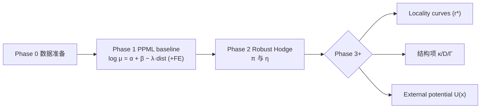

# 管线说明（中文）

## Phase 0：数据准备
- 命令：`python -m project.src.cli ingest` → `marginals` → `prepare`
- 输出：`od_clean.csv`、`nodes_basic.csv`、`edges_with_distance.csv`
- 验收：GEOID 11 位、距离列覆盖 > 99%。

## Phase 1：PPML + 距离/行政 FE
- 命令：
```bash
python -m project.src.cli baseline_glm --backend sklearn --max-iter 10000 --alpha 1e-10 --standardize-dist
```
- 定义：$\log \mu_{ij} = \alpha_i + \beta_j - \lambda \cdot dist_{ij} (+ \text{county pair FE})$。
- 最新结果：$\lambda_{dist} \approx -0.94$，`n_obs = 496096`。
- 输出：`od_residual_glm.parquet|csv`、`baseline_glm_summary.json`。

## Phase 2：Robust Hodge
- 命令：
```bash
python -m project.src.cli potential_hodge_glm \
  --weight-type cap --cap-tau 200 --drop-self \
  --sample-edges 120000 --bins-dist 8 --bins-weight 8 \
  --seed 42 --max-edges 150000 --maxiter 300 --tol 1e-5
```
- 输出：`nodes_potential_glm.csv`、`edges_decomp_glm.csv`、`edges_topk_glm.csv`、`summary_robustness.json`
- 最新指标：$R^2 \approx 0.108$，$\eta \approx 0.935$。

## Phase 2+：循环诊断
- 命令：`python -m project.src.cli rot_diagnostics --topk 2000 --topcycles 500 --nodes-geo project/data/geo/tracts.geojson`
- 输出：`rot_summary.json`（含全局 η、热点边、循环分层）、`top_cycles.csv`、`fig_cycles_hotspots.png`

## Phase 3：PDE 结构项

| 结构项 | 命令 | 主要输出 | 备注 |
| --- | --- | --- | --- |
| 势项 $\kappa$ | `python -m project.src.cli pde_fit_kappa` | `pde_kappa.json`, `fig_kappa_scatter.png` | $\kappa \approx -0.80$，t≈−105 |
| 扩散 $D$ | `python -m project.src.cli pde_fit_diffusion` | `pde_diffusion.json`, `fig_diffusion_scatter.png` | $\Delta R^2 \approx 6\times 10^{-4}$ |
| 界面 $\Gamma$ | `python -m project.src.cli pde_fit_interface --knn 6` | `pde_interface.json`, `fig_interface_scatter.png` | 同样 $\Delta R^2 \approx 6\times 10^{-4}$ |

### Pipeline 图（Mermaid）


### 结构项流程


## 接下来（可选）
- Locality 曲线：`python -m project.src.cli locality_curve --radii 5 10 ...`
- 统计稳健性（CI、置换等）可另行扩展。

更多细节与数据引用参见 `project/docs_summary/zh/structure_results.md`。
